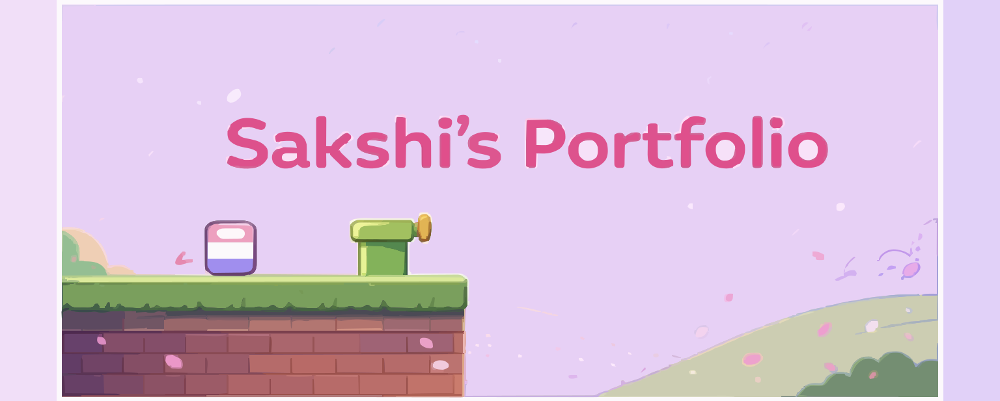
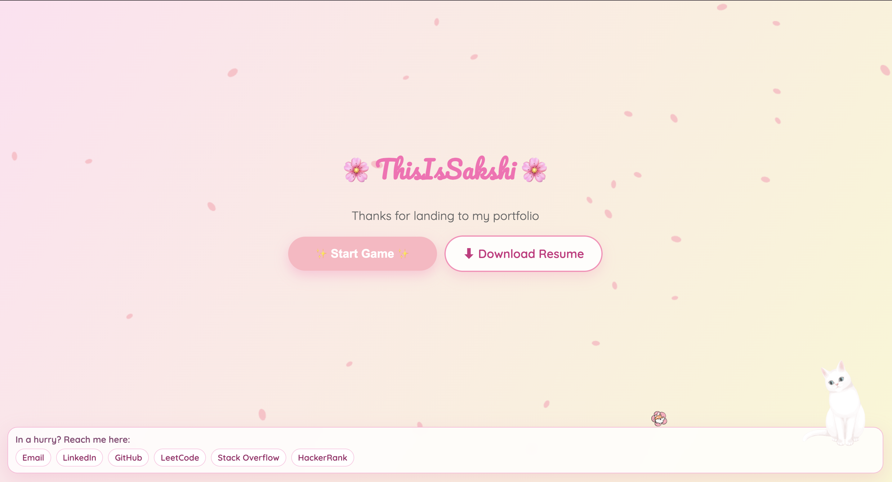
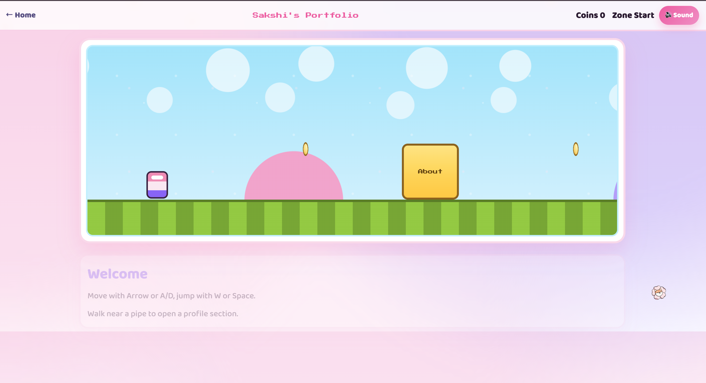
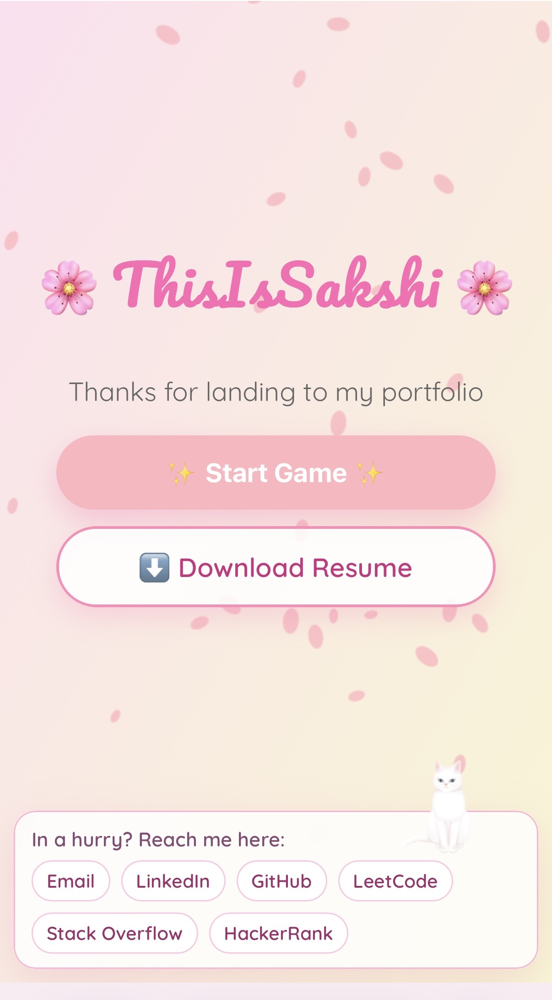
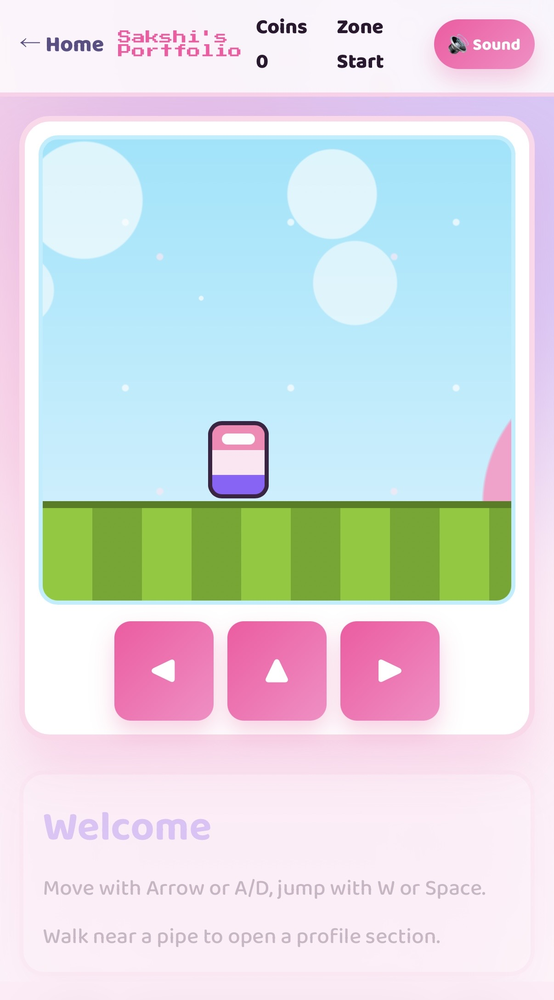

<p align="center">
  
</p>

<p align="center">
  I designed this portfolio as a playful experience: a clean landing screen for quick access, and a side-scrolling game mode to explore my profile in an engaging way.
</p>

<p align="center">
  <a href="https://thisissakshi.github.io/"><strong>Live Website</strong></a>
  <span> | </span>
  <a href="#screenshots"><strong>Screenshots</strong></a>
  <span> | </span>
  <a href="#run-locally"><strong>Run Locally</strong></a>
</p>

<p align="center">
  
  
  
  
</p>

## Why This Portfolio Is Different

Instead of a static resume-style site, I wanted people to interact with my portfolio:

- Recruiters can quickly use the landing page footer and resume button.
- Visitors who want more context can explore my sections by moving through a game world.
- The experience stays lightweight: no frameworks, no heavy build tooling, just clean HTML/CSS/JS.

## Main Experience

| Layer | What It Does | Where It Lives |
|---|---|---|
| Landing screen | First impression, quick links, resume download | `index.html`, `style.css`, `script.js` |
| Game portfolio | About/Skills/Experience/Projects/Achievements/Contact as zones | `game/index.html`, `game/game.css`, `game/game.js` |
| Sakura ambience | Petal animation canvas overlay | `sakura.js` |
| Shared cursor effects | Sparkle follower + hover pointer behavior across pages | `shared/cursor-effects.js`, `shared/cursor-effects.css` |
| In-game sound | Jump, coin, zone tones with mobile audio unlock handling | `game/game.js` |

## How It Works

### Landing Screen

- `Start Game` routes to `/game`.
- `Download Resume` serves `assets/Sakshi_Resume.pdf`.
- Footer includes direct contact/profile links for fast access.

### Game Screen

- Player movement supports keyboard and mobile controls.
- Pipes represent profile sections and activate panel rendering.
- Coins and movement keep the navigation interactive.
- The right panel renders content from one profile data source.

### Profile Data Source

I keep my primary portfolio content centralized in:

- `game/game.js`
- `const profile = { ... }`

Updating this object updates About, Skills, Experience, Projects, Achievements, and Contact in one place.

### Audio Notes (Mobile)

- Sound uses Web Audio API.
- Mobile browsers require a user gesture before audio can play.
- I added unlock + priming logic to reduce first-sound delay on phones.

## Project Structure

```text
.
├── index.html
├── style.css
├── script.js
├── sakura.js
├── game/
│   ├── index.html
│   ├── game.css
│   └── game.js
├── shared/
│   ├── cursor-effects.css
│   └── cursor-effects.js
└── assets/
    ├── Sakshi_Resume.pdf
    ├── sakshi-logo.svg
    └── screenshots/
```

## Controls

### Desktop

- Move: `ArrowLeft` / `ArrowRight` or `A` / `D`
- Jump: `ArrowUp`, `W`, or `Space`

### Mobile

- On-screen controls: `Left`, `Jump`, `Right`

## Screenshots

<p align="center">
  
  
</p>

<p align="center">
  
</p>

<p align="center">
  
  
</p>

## Run Locally

No build step required.

```bash
git clone https://github.com/ThisIsSakshi/ThisIsSakshi.github.io.git
cd ThisIsSakshi.github.io
python3 -m http.server 8080
```

Open:

- `http://localhost:8080/`

## Deployment

This is deployed through GitHub Pages:

1. Push changes to the default branch.
2. GitHub Pages serves the static files automatically.

## License

Licensed under `LICENSE.md`.
